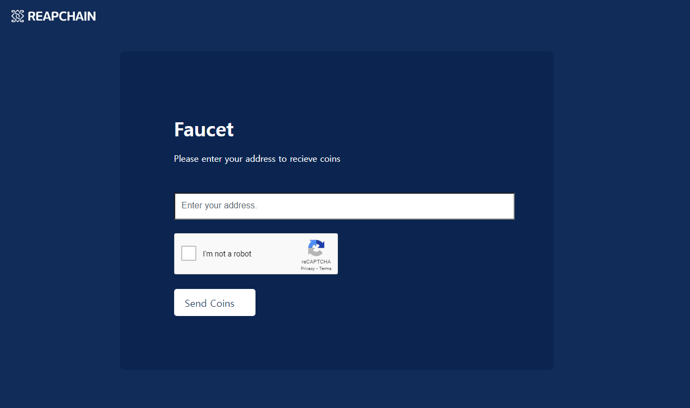

# Faucet

Once you've set up your account information, you can now receive some coins from the Faucet.&#x20;

There are two ways you can do this

### Web Interface

1. Visit [http://faucet.reapchain.com/](http://faucet.reapchain.com)&#x20;
2. Enter your account address
3. Verify that you are not a robot
4. Transfer some coins



### Command Line Interface

Use a curl command to post a request like this:

```
curl -X POST -d '{"address": "reap1rdwpue39cxt7meyp4t8v3ufs86sqx0hj95j6c5"}' http://faucet.reapchain.com
```

If successful the return message should look like this:&#x20;

```
{"transfers":[{"coin":"10000000ureap","status":"ok"}]}
```

### Transfer Limits

A single faucet request transfers 10,000,000ureap with a daily total limit of 100,000,000ureap per account.

### Checking Balance

In order to check your balance, you need to execute this command:

```
./reapchaind query bank balances $MY_ADDRESS --node $NODE_IP --chain-id $CHAIN_ID
```

You need to replace these variables:

1. **$MY\_ADDRESS** - Your address for your account
2. **$NODE\_IP** - The IP address for a node in the ReapChain TestNet. Currently you can use [http://3.37.240.100:27100/](http://3.37.240.100:27100)
3. **$CHAIN\_ID** - The ID for the blockchain. Currently you can use reapchain

An example:

```
./reapchaind query bank balances reap1rdwpue39cxt7meyp4t8v3ufs86sqx0hj95j6c5 --node http://3.37.240.100:27100/ --chain-id reapchain
```

If successful, the return message should look like this:

```
balances:
- amount: "10000000"
  denom: ureap
pagination:
  next_key: null
  total: "0"
```
